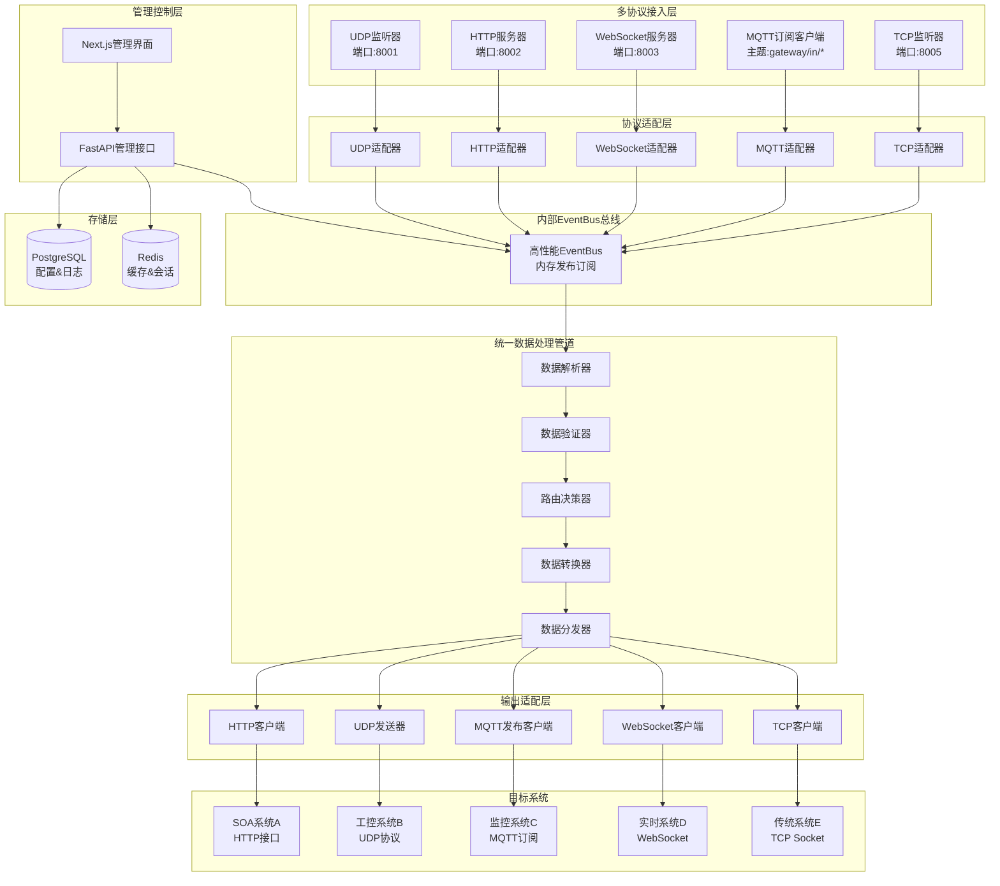
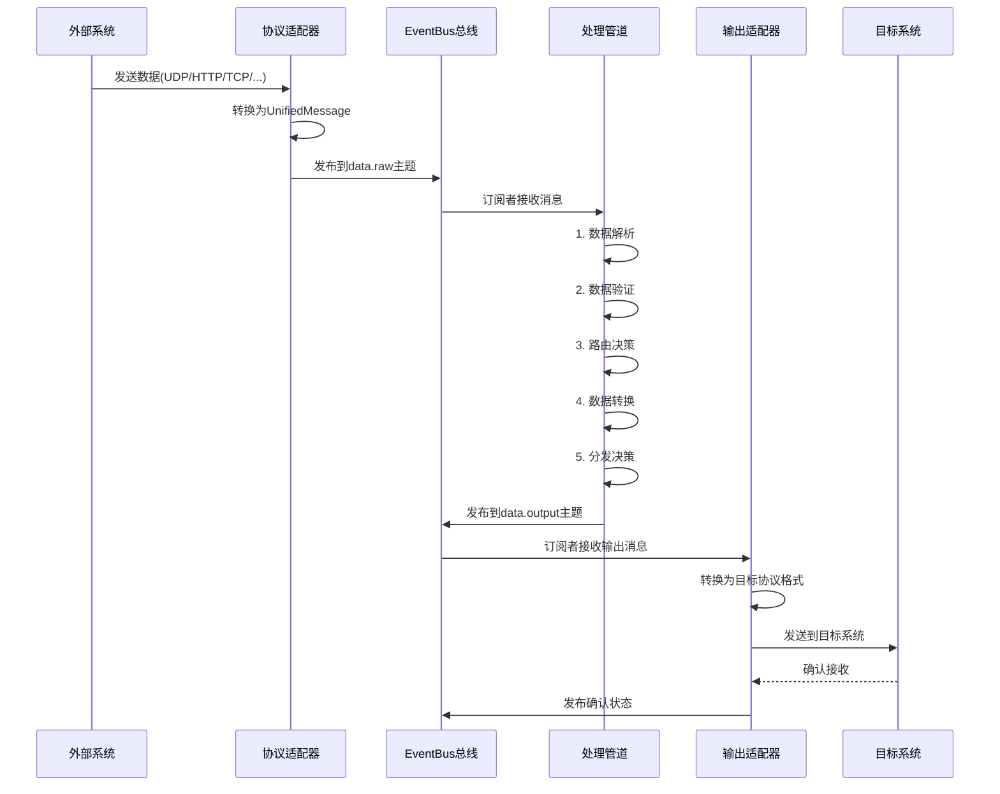
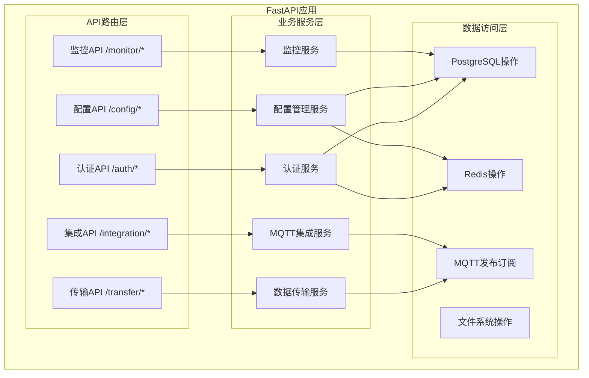
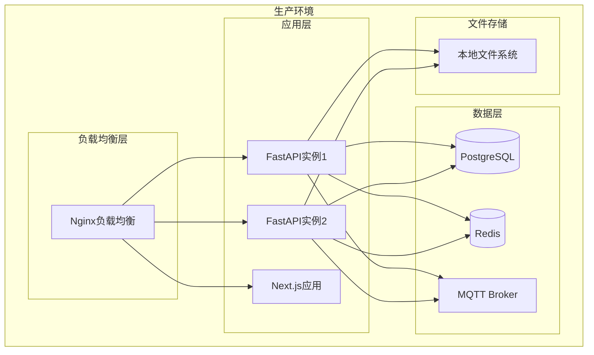

# 统一API网关系统架构设计

## 1. 系统定位

本系统是一个**统一数据接入网关**，核心功能是：
- **多协议接入**: 同时接收UDP、HTTP、WebSocket、MQTT、TCP等多种协议数据
- **协议转换适配**: 将不同协议数据转换为统一格式进行处理
- **统一数据处理**: 提供数据解析、验证、路由、加密等统一处理管道
- **多目标分发**: 根据配置将处理后的数据分发到不同目标系统

## 2. 设计原则

- **技术栈简化**: 只使用熟悉的PostgreSQL、Redis、Nginx、MQTT等
- **协议统一**: 所有协议数据转换为统一格式处理
- **管道式处理**: 数据流经标准化的处理管道
- **可配置路由**: 灵活的数据路由和分发规则

## 3. 简化技术栈

### 核心技术栈
- **前端**: Next.js 15 + React 19 + TypeScript + Tailwind CSS v4
- **后端**: FastAPI + Python + Pydantic
- **数据库**: PostgreSQL（主存储） + Redis（缓存）
- **Web服务器**: Nginx（反向代理 + 负载均衡）
- **消息代理**: 内存EventBus (高性能发布订阅)
- **实时通信**: WebSocket（FastAPI内置）+ Socket.IO


### 前端技术栈优势
- **Next.js 15 + Turbopack**: 极速开发构建，比Webpack快10倍
- **React 19 Compiler**: 自动优化性能，减少手动优化工作
- **React Actions**: 简化表单处理，内置Loading和Error状态
- **Tailwind CSS v4**: 零配置启动，更好的性能和DX
- **TypeScript**: 严格类型检查，减少运行时错误

## 4. 统一API网关架构



### 4.1 内存组帧与高速分发
- 目标：降低复制与序列化，利用零拷贝/缓冲池/批量派发提升吞吐。
- 关键点：
    - 环形缓冲区 + slab 分配，帧内存复用与回收；
    - 固定长/变长帧解析（起止标志/长度字段/校验位），提供重排窗口（可选，容忍 UDP 乱序）；
    - 解析后进入就近队列（CPU 亲和）→ 分发器批量扇出到目标；
    - 度量：队列深度、批量大小、丢弃/重试次数、处理时延分位数。

### 4.2 UDP 单点/组播
- 单点：目标 host:port；组播：maddr:port 加入/退出组播组；
- 可选上层序号 + 时间戳，配置最大乱序窗口与丢弃策略；
- 加密优先在应用层（AES-GCM）再发送。

### 4.3 动态配置与热更新
- 配置项：数据源、帧格式、路由规则、目标系统、加密策略；
- 版本化与原子切换：新版本加载成功后原子替换活跃配置；
- 通知：EventBus `config.changed` 主题广播；失败自动回滚上一版本。

### 4.4 监控与审计（与前端对齐）
- 指标：QPS、p50/p95/p99、队列深度、错误率、丢包/重排率、CPU/内存、连接数；
- 日志：转发日志、错误日志、审计日志（用户/操作/结果）；
- 实时：WS/SSE 推送 metrics/logs，前端订阅展示；
- 拓扑：由目标系统与路由生成链路图，标注健康与关键指标。

### 4.5 API 与前端一致性
- 帧配置：CRUD + 解析测试；
- 路由：CRUD + 发布生效；
- 目标系统：CRUD + 连通性测试；
- 密钥：发放/轮换/停用；
- 监控/日志：分页查询 + 实时订阅；
- 健康：/health 汇总 + /health/components 明细。

## 5. 数据流处理管道



## 6. 统一数据模型

```python
from pydantic import BaseModel
from typing import Any, Dict, Optional, List
from datetime import datetime
from enum import Enum

class ProtocolType(str, Enum):
    UDP = "UDP"
    HTTP = "HTTP"
    WEBSOCKET = "WebSocket"
    MQTT = "MQTT"
    TCP = "TCP"

class UnifiedMessage(BaseModel):
    # 元数据
    message_id: str                    # 唯一消息ID
    timestamp: datetime               # 接收时间
    source_protocol: ProtocolType     # 来源协议
    source_id: str                   # 数据源标识

    # 原始数据
    raw_data: bytes                  # 原始字节数据
    headers: Dict[str, Any]          # 协议头信息

    # 解析后数据
    parsed_data: Optional[Dict[str, Any]] = None
    data_type: Optional[str] = None
    content_type: Optional[str] = None

    # 路由信息
    target_systems: List[str] = []
    routing_rules: Dict[str, Any] = {}
    priority: int = 5                # 优先级 1-10

    # 处理状态
    processing_status: str = "pending"
    error_message: Optional[str] = None
```

## 7. EventBus主题设计

```
gateway/
├── data/                           # 数据流主题
│   ├── raw                        # 原始数据
│   ├── parsed                     # 解析后数据
│   ├── validated                  # 验证后数据
│   ├── routed                     # 路由后数据
│   └── output                     # 输出数据
│
├── system/                        # 系统事件主题
│   ├── config.changed            # 配置变更
│   ├── adapter.status            # 适配器状态
│   ├── health.check              # 健康检查
│   └── startup.shutdown          # 启动关闭
│
├── monitor/                       # 监控主题
│   ├── metrics.update            # 性能指标
│   ├── error.event               # 错误事件
│   ├── audit.log                 # 审计日志
│   └── performance               # 性能数据
│
└── control/                       # 控制命令主题
    ├── adapter.start             # 启动适配器
    ├── adapter.stop              # 停止适配器
    └── config.reload             # 重新加载配置
```

## 8. 协议适配器设计

```python
from abc import ABC, abstractmethod
import uuid
from datetime import datetime
from app.core.eventbus.simple_eventbus import event_bus

class ProtocolAdapter(ABC):
    def __init__(self, adapter_id: str):
        self.adapter_id = adapter_id
        self.protocol_type = None

    @abstractmethod
    async def receive_data(self) -> UnifiedMessage:
        """接收协议数据并转换为统一格式"""
        pass

    @abstractmethod
    async def send_data(self, message: UnifiedMessage) -> bool:
        """将统一格式数据发送到目标协议"""
        pass

    def publish_to_pipeline(self, message: UnifiedMessage):
        """发布消息到处理管道"""
        event_bus.publish("gateway.data.raw", {
            "message": message,
            "adapter_id": self.adapter_id
        }, source=self.adapter_id)

class UDPAdapter(ProtocolAdapter):
    def __init__(self, adapter_id: str, host="0.0.0.0", port=8001):
        super().__init__(adapter_id)
        self.protocol_type = ProtocolType.UDP
        self.host = host
        self.port = port
        self.socket = None

    async def receive_data(self) -> UnifiedMessage:
        data, addr = await self.socket.recvfrom(1024)
        return UnifiedMessage(
            message_id=str(uuid.uuid4()),
            timestamp=datetime.now(),
            source_protocol=ProtocolType.UDP,
            source_id=f"udp://{addr[0]}:{addr[1]}",
            raw_data=data,
            headers={"source_addr": addr, "data_length": len(data)}
        )

class HTTPAdapter(ProtocolAdapter):
    def __init__(self, adapter_id: str):
        super().__init__(adapter_id)
        self.protocol_type = ProtocolType.HTTP

    async def receive_data(self, request) -> UnifiedMessage:
        body = await request.body()
        return UnifiedMessage(
            message_id=str(uuid.uuid4()),
            timestamp=datetime.now(),
            source_protocol=ProtocolType.HTTP,
            source_id=f"http://{request.client.host}",
            raw_data=body,
            headers={
                "method": request.method,
                "url": str(request.url),
                "headers": dict(request.headers),
                "content_type": request.headers.get("content-type")
            }
        )
```

## 9. 数据处理管道设计

```python
class DataPipeline:
    def __init__(self):
        self.processors = [
            DataParser(),          # 数据解析器
            DataValidator(),       # 数据验证器
            DataRouter(),          # 路由决策器
            DataTransformer(),     # 数据转换器
            DataDistributor()      # 数据分发器
        ]

    def start(self):
        """启动管道"""
        # 订阅原始数据
        event_bus.subscribe("gateway.data.raw", self.process_raw_data)

    def process_raw_data(self, event):
        """处理原始数据"""
        message = event.data["message"]

        try:
            # 逐步处理
            current_message = message

            for processor in self.processors:
                current_message = processor.process(current_message)
                if current_message is None:
                    self.log_error(f"处理失败在 {processor.__class__.__name__}")
                    return

            # 发布处理完成的消息
            event_bus.publish("gateway.data.output", {
                "message": current_message
            }, source="pipeline")

        except Exception as e:
            self.log_error(f"管道处理异常: {e}")

class DataParser:
    """数据解析器 - 根据配置解析不同格式的数据"""
    def process(self, message: UnifiedMessage) -> Optional[UnifiedMessage]:
        # 根据source_id和data_type从数据库获取解析规则
        parse_config = self.get_parse_config(message.source_id)

        if parse_config:
            try:
                # 解析数据
                parsed_data = self.parse_by_config(message.raw_data, parse_config)
                message.parsed_data = parsed_data
                message.data_type = parse_config.data_type
                message.processing_status = "parsed"

                # 发布解析完成事件
                event_bus.publish("gateway.data.parsed", {
                    "message": message
                }, source="parser")

                return message
            except Exception as e:
                message.error_message = f"解析失败: {e}"
                return None
        return message

class DataRouter:
    """路由决策器 - 决定数据发送到哪些目标系统"""
    def process(self, message: UnifiedMessage) -> Optional[UnifiedMessage]:
        # 从数据库获取路由规则
        routing_rules = self.get_routing_rules(message.data_type, message.source_id)

        # 应用路由规则
        target_systems = []
        for rule in routing_rules:
            if self.match_rule(message, rule):
                target_systems.extend(rule.target_systems)

        message.target_systems = list(set(target_systems))  # 去重
        message.processing_status = "routed"

        # 发布路由完成事件
        event_bus.publish("gateway.data.routed", {
            "message": message
        }, source="router")

        return message
```

## 10. 数据库简化设计

### PostgreSQL统一存储方案

```sql
-- 数据源配置表
CREATE TABLE data_sources (
    id UUID PRIMARY KEY DEFAULT gen_random_uuid(),
    name VARCHAR(100) NOT NULL,
    protocol_type VARCHAR(20) NOT NULL, -- UDP/HTTP/MQTT/WebSocket/TCP
    connection_config JSONB NOT NULL,   -- 连接配置
    parse_rules JSONB,                  -- 数据解析规则
    is_active BOOLEAN DEFAULT true,
    created_at TIMESTAMP DEFAULT NOW()
);

-- 目标系统配置表
CREATE TABLE target_systems (
    id UUID PRIMARY KEY DEFAULT gen_random_uuid(),
    name VARCHAR(100) NOT NULL,
    protocol_type VARCHAR(20) NOT NULL,
    endpoint_config JSONB NOT NULL,     -- 端点配置
    auth_config JSONB,                  -- 认证配置
    transform_rules JSONB,              -- 数据转换规则
    is_active BOOLEAN DEFAULT true,
    created_at TIMESTAMP DEFAULT NOW()
);

-- 路由规则表
CREATE TABLE routing_rules (
    id UUID PRIMARY KEY DEFAULT gen_random_uuid(),
    name VARCHAR(100) NOT NULL,
    source_pattern VARCHAR(200),        -- 数据源匹配模式
    data_type_pattern VARCHAR(100),     -- 数据类型匹配模式
    target_systems UUID[] NOT NULL,     -- 目标系统ID数组
    conditions JSONB,                   -- 路由条件
    priority INTEGER DEFAULT 5,         -- 优先级
    is_active BOOLEAN DEFAULT true,
    created_at TIMESTAMP DEFAULT NOW()
);

-- 消息处理日志表（时序数据）
CREATE TABLE message_logs (
    id UUID PRIMARY KEY DEFAULT gen_random_uuid(),
    message_id VARCHAR(100) NOT NULL,
    timestamp TIMESTAMP NOT NULL,
    source_protocol VARCHAR(20),
    source_id VARCHAR(200),
    target_systems TEXT[],
    processing_status VARCHAR(50),
    processing_time_ms INTEGER,
    error_message TEXT,
    data_size INTEGER
);

-- 为时序查询创建索引
CREATE INDEX idx_message_logs_timestamp ON message_logs(timestamp);
CREATE INDEX idx_message_logs_source ON message_logs(source_protocol, source_id);
CREATE INDEX idx_message_logs_status ON message_logs(processing_status);

-- 系统监控指标表
CREATE TABLE system_metrics (
    id UUID PRIMARY KEY DEFAULT gen_random_uuid(),
    timestamp TIMESTAMP NOT NULL,
    metric_name VARCHAR(100) NOT NULL,
    metric_value FLOAT NOT NULL,
    tags JSONB,
    service_name VARCHAR(50)
);

CREATE INDEX idx_metrics_timestamp_name ON system_metrics(timestamp, metric_name);
```

## 7. 核心服务架构



## 8. 协议转换器设计

### UDP到MQTT转换器
```python
class UDPToMQTTConverter:
    def __init__(self, mqtt_client):
        self.mqtt_client = mqtt_client
        self.frame_parsers = {}

    async def process_udp_data(self, data: bytes, source_addr: str):
        try:
            # 1. 识别数据源
            source_id = self.identify_source(source_addr)

            # 2. 原始数据发布
            await self.publish_raw_data(source_id, data)

            # 3. 数据帧解析
            parsed_data = await self.parse_frame(data, source_id)

            # 4. 发布解析后数据
            if parsed_data:
                topic = f"gateway/data/parsed/{parsed_data.type}"
                await self.mqtt_client.publish(topic, parsed_data.to_json())

        except Exception as e:
            await self.publish_error(f"UDP转换错误: {e}")
```

### 第三方系统适配器
```python
class ThirdPartyAdapter:
    def __init__(self, system_config):
        self.config = system_config
        self.mqtt_client = mqtt_client

    async def subscribe_to_system(self, topics: List[str]):
        """订阅第三方系统的MQTT主题"""
        for topic in topics:
            await self.mqtt_client.subscribe(
                f"gateway/integration/subscribe/{self.config.name}/{topic}"
            )

    async def publish_to_system(self, data: dict, target_topic: str):
        """发布数据到第三方系统"""
        topic = f"gateway/integration/publish/{self.config.name}/{target_topic}"
        await self.mqtt_client.publish(topic, json.dumps(data))
```

## 9. 部署架构



## 10. 开发优势

### 技术优势
1. **低复杂度**: 只使用5个核心技术组件
2. **高可控性**: 所有组件都是熟悉且成熟的技术
3. **易维护性**: 减少学习成本和维护难度
4. **高性能**: PostgreSQL + Redis + MQTT的组合性能优秀

### 实施优势
1. **快速开发**: 无需学习大量新技术
2. **稳定可靠**: 基于成熟技术栈，减少风险
3. **成本控制**: 减少第三方服务和许可成本
4. **问题排查**: 熟悉的技术便于快速定位问题

## 11. 开发路径建议

### Phase 1: 基础框架（2周）
1. 搭建Next.js 15 + React 19 + FastAPI基础框架
2. 配置Turbopack构建和React Compiler
3. 配置PostgreSQL + Redis
4. 实现基础认证和权限管理（使用React Actions）
5. 搭建MQTT Broker

### Phase 2: 核心功能（3周）
1. 实现UDP数据接收和解析
2. 开发MQTT协议转换器
3. 构建配置管理界面（使用React 19新特性）
4. 实现基础监控功能（WebSocket + use() Hook）

### Phase 3: 集成功能（2周）
1. 第三方系统MQTT适配器
2. 数据加密和安全传输
3. 实时监控和可视化（React Suspense）
4. 系统测试和性能优化

这个简化架构保持了原有需求的核心功能，但大大降低了技术复杂度和维护成本。